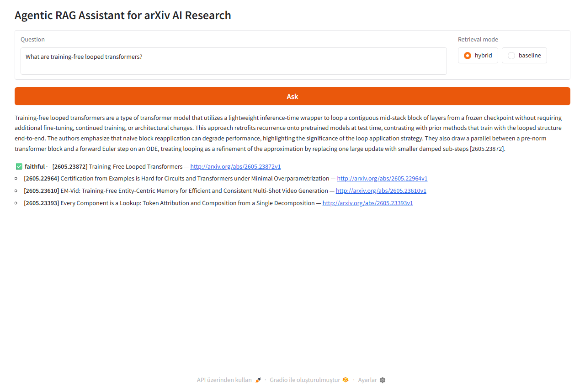
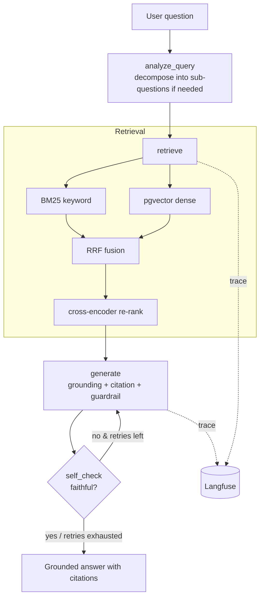

<!--
HF Spaces (Docker SDK) reads this frontmatter. `app_port: 8000` aligns with the
Dockerfile default and does not break Railway's $PORT injection. Without
frontmatter, HF Spaces defaults to port 7860 and the "Live Demo" link breaks.
-->

# Agentic RAG Assistant for arXiv AI Research

> Production-grade RAG over arXiv AI/ML papers — LangGraph orchestration, hybrid
> retrieval (BM25 + vector) with cross-encoder re-ranking, RAGAS evaluation,
> Langfuse observability, model-agnostic LLM backend.

[Live Demo](https://huggingface.co/spaces/mertdurukan/agentic-rag-assistant) · [Architecture](#architecture) · [Evaluation](#evaluation) · [Design decisions](DECISIONS.md) · [Deploy guide](DEPLOY.md)


> **Note:** The HF Space sleeps after inactivity to save compute. The first request takes ~30 seconds to wake the container; subsequent requests are immediate.

## What this is

An agentic RAG assistant that answers AI/ML questions with **grounded, cited
answers** over arXiv research papers. A user asks a question; the system retrieves
relevant papers with hybrid search and re-ranking, performs multi-step reasoning
through LangGraph, self-checks the response, and returns a grounded answer with
inline citations.



<sub>Screenshot from the live system: a real question flows through hybrid retrieval
→ re-rank → grounded answer → `[2605.23872]` citation + ✅ faithful badge + source
links. To reproduce: `make ingest && make serve && python -m scripts.screenshot_ui`
(with uvicorn running on port 8000).</sub>

## Design choices  ([full rationale: DECISIONS.md](DECISIONS.md))
- **Hybrid search (BM25 + vector):** pure vector retrieval misses exact-term and abbreviation matches; combining lexical and semantic, then re-ranking, raises both recall and precision.
- **Cross-encoder re-ranking:** initial retrieval is broad and noisy; a cross-encoder scores query–document pairs jointly for tighter relevance.
- **RRF fusion:** rank-based instead of score-based, so heterogeneous scoring scales (BM25 vs. cosine similarity) combine cleanly.
- **LangGraph:** conditional routing and a self-check loop — not a linear chain.
- **RAGAS:** measured faithfulness, precision, and recall instead of vibes.
- **Model-agnostic backend:** Ollama / OpenAI / Anthropic swappable via config.

## Architecture


## Evaluation
RAGAS scores (baseline = vector-only, hybrid = vector + BM25 + rerank).
**Numbers are reproduced by `python -m src.eval.ragas_eval --mode both`**, which
writes results to [`benchmarks/baseline_vs_hybrid.md`](benchmarks/baseline_vs_hybrid.md).

| Setup | faithfulness | context_precision | context_recall | answer_relevancy |
|---|---|---|---|---|
| Baseline (vector-only) | 0.8981 | 0.6001 | 0.8333 | 0.8653 |
| Hybrid + re-rank (this) | **0.9673** | **0.7618** | **0.8583** | **0.9351** |

Corpus: 300 papers · 934 chunks (recent arXiv cs.AI/cs.LG/cs.CL) · golden set: 12 questions
(calibrated to the corpus) · LLM (generation + judge): `gpt-4o-mini` · latency: 4.92 → 6.50 s per question.
The largest gain is in `context_precision` (**+27%**), which is the expected impact of
cross-encoder re-ranking. Full analysis: [`benchmarks/baseline_vs_hybrid.md`](benchmarks/baseline_vs_hybrid.md).

## Stack
Python 3.11 · LangGraph · LangChain · pgvector (Postgres) · sentence-transformers
(embedding + cross-encoder) · rank-bm25 · RAGAS · Langfuse · FastAPI · Gradio ·
Ollama / OpenAI / Anthropic (swappable)

## Run locally

> **Prerequisites:** Python 3.11+, Docker Desktop (for Postgres + pgvector), Ollama
> (for local LLM — optional; a hosted provider works too).

```bash
# 0) Environment
python -m venv .venv
# Linux/macOS:
source .venv/bin/activate
# Windows PowerShell:
# .venv\Scripts\Activate.ps1
pip install -r requirements.txt
cp .env.example .env          # edit values (real keys go in .env, NOT the repo)

# 1) Vector DB (Postgres + pgvector)
make db                       # docker compose up -d
# Verify: docker compose ps    →  rag_pgvector should be "healthy"
# Verify: docker exec rag_pgvector psql -U rag -d ragdb -c "SELECT extname FROM pg_extension WHERE extname='vector';"

# 2) (Local LLM only) Ollama
ollama serve                  # in a separate terminal
ollama pull llama3.1

# 3) Smoke ingest (small corpus, fast) — ARXIV_MAX_RESULTS=30 by default in .env
make ingest                   # python -m scripts.ingest
# Expected output: "Total N chunks." + "Vectors written: N/N"

# 4) Smoke query — single-line sanity test
python -c "from src.assistant import Assistant; a = Assistant(); r = a.ask('What are the trade-offs of MoE?'); print(r.answer); print('SOURCES:', r.sources)"

# 5) Evaluate (produces real RAGAS numbers, writes benchmarks/baseline_vs_hybrid.md)
make eval                     # python -m src.eval.ragas_eval --mode both

# 6) (Optional) for the full corpus, set ARXIV_MAX_RESULTS=300+ and re-run steps 3-5

# 7) API + UI
make serve                    # http://localhost:8000  (UI: /, API docs: /docs)
```

### Troubleshooting

- **`pg_isready` not healthy:** check `docker compose logs db`. Port 5432 may be
  held by another local Postgres instance.
- **`vector` extension not found:** create it manually with
  `docker exec -it rag_pgvector psql -U rag -d ragdb -c "CREATE EXTENSION IF NOT EXISTS vector;"`.
- **Ollama 404 / connection refused:** verify `OLLAMA_BASE_URL`; check
  `ollama list` to confirm the model is pulled.
- **RAGAS evaluate throws an exception:** `raise_exceptions=True` is intentional —
  one failed row stops the eval rather than silently averaging over NaNs. Remove
  the failing row from the golden set or harden the prompt.
- **Slow HuggingFace model downloads:** the first run pulls bge-small (~130 MB)
  and the cross-encoder (~80 MB). Use `HF_HOME` to redirect the cache.

## Production considerations
- **Secrets:** API keys never live in the repo; `.env` is git-ignored, `.env.example` documents the schema.
- **Error handling:** JSON parse fallback (for noisy local-model outputs); Langfuse is optional and degrades gracefully if unreachable.
- **Guardrails:** when context is insufficient, the model returns "I don't have enough grounded context" instead of hallucinating.
- **Observability:** every LangGraph step, latency, token, and cost is traced in Langfuse.
- **Cost:** local-first development; hosted models used only in the demo.
- **Idempotent ingestion:** upserts on `chunk_id`; re-running ingestion does not create duplicates.

## Tests
```bash
make test     # pytest (pure-logic unit tests, no external services required)
make lint     # ruff
```

## Repo layout
```
src/ingestion       arXiv fetching + chunking + persistence
src/retrieval       vector_store (pgvector) · bm25 · hybrid (RRF) · reranker · pipeline
src/agent           LangGraph: graph · nodes · prompts
src/eval            RAGAS harness + golden set
src/observability   Langfuse tracing
src/llm             model-agnostic provider
app/main.py         FastAPI + Gradio
benchmarks/         baseline vs hybrid (auto-generated)
DECISIONS.md        rationale for each architectural decision
```

## License

MIT — see [LICENSE](LICENSE).
